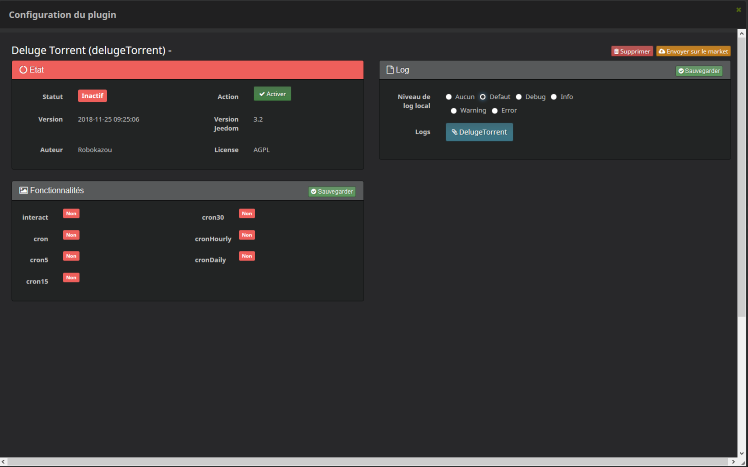
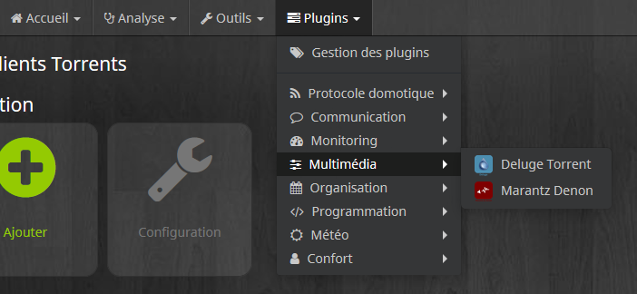
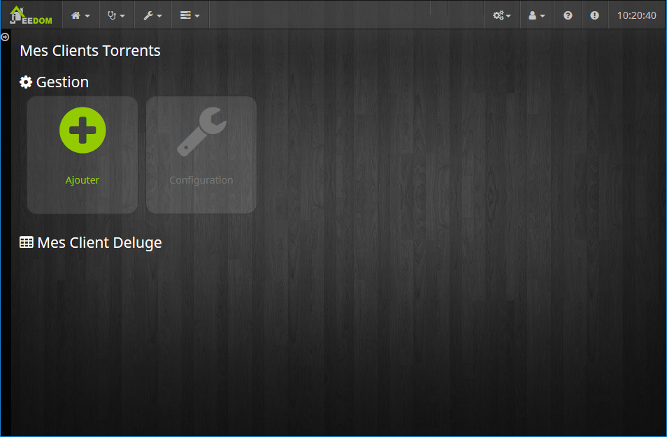
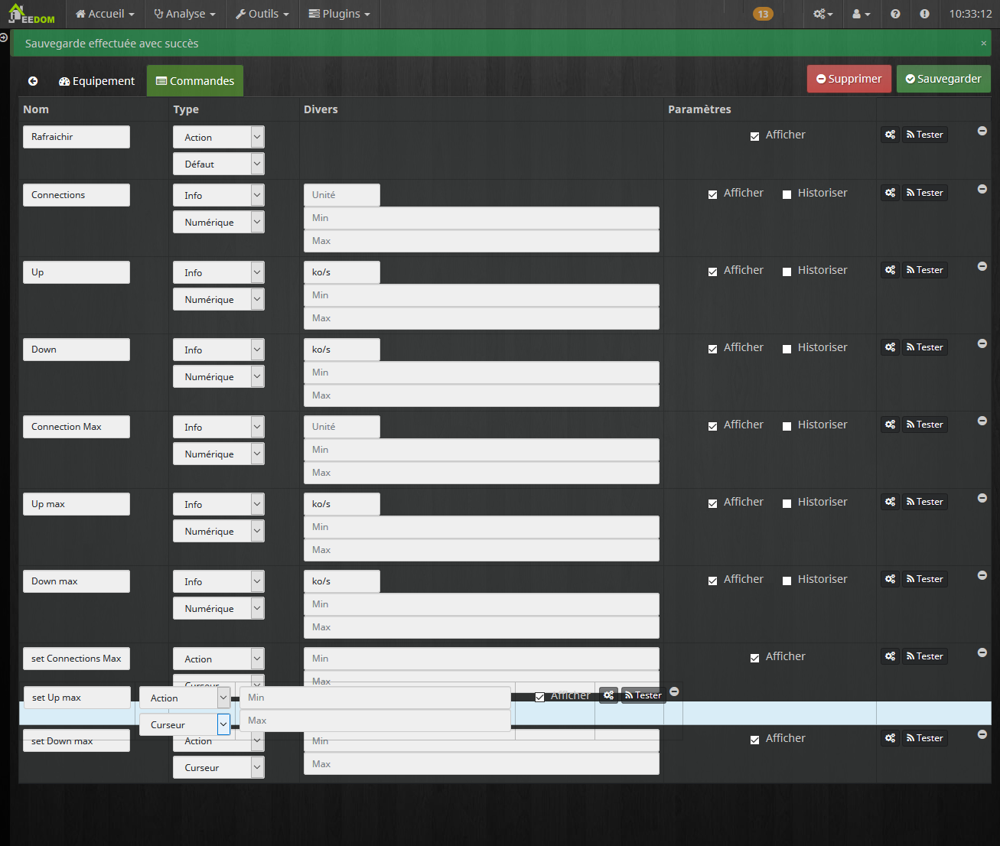
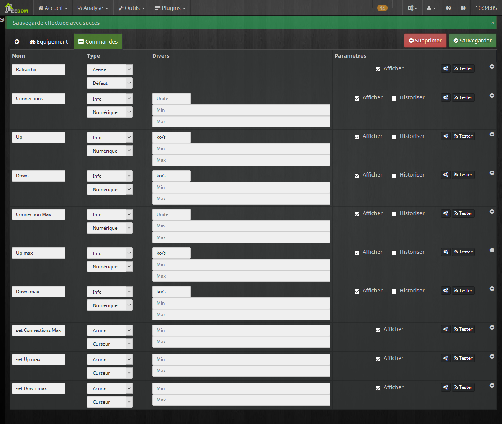

Description 
===

Plugin pour piloté un client deluge Torrent [https://deluge-torrent.org/](https://deluge-torrent.org/)

Dépendance
===

Ce plugin ce base sur un plugin dans deluge pour fonctionner. Il faut donc que ce dernier soit correctement install [Voir ici](https://github.com/idlesign/deluge-webapi#installation)

L'installation est très simple si vous avez deja le WebUI. Sinon, commencer par installer le WebUI.

Aussi, penser à bien activer le plugin.

Création d'un Équipement deluge
===

Aller dans :

Cliquer sur "Ajouter" :

Choisir un Nom pour votre client Torrent:

Puis Cliquer sûr l'onglé "Commande"

Arranger l'ordre des attributes jeedom avec des Drag & drop:

Je vous propose l'ordre suivant (Mais libre à vous de choisir):

Puis configure les Min et Max en fonction des capacités de votre conection internet (à defaut jeedom à 0 mini 100 maxi)

Voila C'est Fini !!
