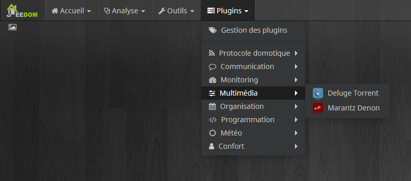

Description 
===

Plugin pour piloter un client Deluge Torrent [https://deluge-torrent.org/](https://deluge-torrent.org/)

Dépendance
===

Ce plugin ce base sur un plugin dans Deluge pour fonctionner. Il faut donc que ce dernier soit correctement install [Voir ici](https://github.com/idlesign/deluge-webapi#installation)

L'installation est très simple si vous avez déjà le WebUI. Sinon, commencez par installer le WebUI.

Aussi, pensez à bien activer le plugin.

Création d'un Équipement Deluge
===

Aller dans :

Cliquer sur "Ajouter" :

Choisir un Nom pour votre client Torrent:

Renseignez l'IP ou l'URL de votre DelugeWeb et le port. Le Port par defaut de delugeWeb est 8112.

Le mot de passe de votre DelugeWeb.

Et la fréquence de rafraîchissement des commandes.

N'oubliez pas d'Activer l'équipement et de le rendre Visible. Eventuellement de lui choisi un Catégorie et un "Objet parent"

Puis cliquez sûr l'onglé "Commande"

Arrangez l'ordre des commandes Jeedom avec des Drag & drop:

Je vous propose l'ordre suivant (Mais libre à vous de choisir):

Puis configurez les Min et Max en fonction des capacités de votre connexion internet (à défaut Jeedom à 0 mini 100 maxi)

NE PAS OUBLIER DE SAUVEGARDER

Redimensionner le Widget
===

Si vous avais bien configurer (activer l'l'équipement et mis Visible et Choisie un catégorie). Vous devriez avoir ceci sûr le Dashboard :

Cliquez sur le crayon en haut a droit pour le redimensionner:

À fin d'obtenir ceci :

Re cliquez sur le crayon en haut a droit pour sauvegarder votre redimensionnement:

Voila c'est fini !!
