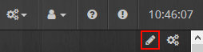

Description 
===

Plugin pour piloté un client deluge Torrent [https://deluge-torrent.org/](https://deluge-torrent.org/)

Dépendance
===

Ce plugin ce base sur un plugin dans deluge pour fonctionner. Il faut donc que ce dernier soit correctement install [Voir ici](https://github.com/idlesign/deluge-webapi#installation)

L'installation est très simple si vous avez deja le WebUI. Sinon, commencer par installer le WebUI.

Aussi, penser à bien activer le plugin.

Création d'un Équipement deluge
===

Aller dans :

Cliquer sur "Ajouter" :

Choisir un Nom pour votre client Torrent:

Reseigner l'ip ou l'url de votre delugeWeb et le port. Le Port par defaut de delugeWeb est :8112.

Le mot de passe de votre DelugeWeb.

Et la fréquence de rafraichisement des commandes.

N'oublier pas d'Activer l'équipement et de le rendre Visible. Eventuellement de lui choisi un Categorie et un "Objet parent"

Puis Cliquer sûr l'onglé "Commande"

Arranger l'ordre des attributes jeedom avec des Drag & drop:

Je vous propose l'ordre suivant (Mais libre à vous de choisir):

Puis configure les Min et Max en fonction des capacités de votre conection internet (à defaut jeedom à 0 mini 100 maxi)

NE PAS OUBLIER DE SAUVEGARDER

Redimensionner le Widget
===

Si vous avais bien configurer (activer l'equipement et mis Visible et Choisie un categorie). Vous devrier avoir ceci sur le Dashboard :

Cliquer sûr le crayon en haut a droit pour le redimentionner:

À fin d'obtenir ceci :

re cliquer sûr le crayon en haut a droit pour sauvegarder votre redimentionnement:

Voila C'est Fini !!
